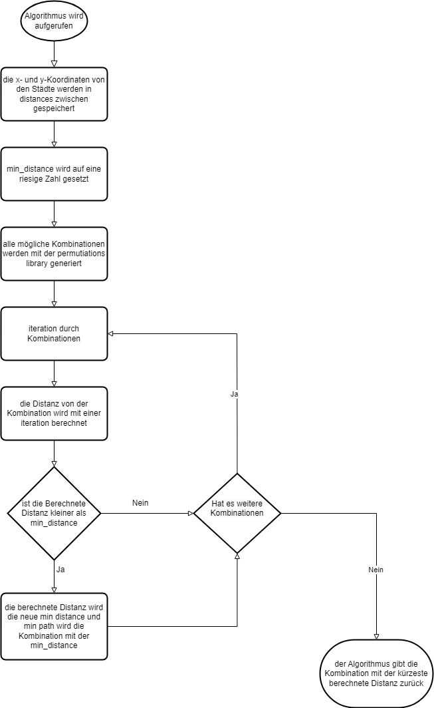
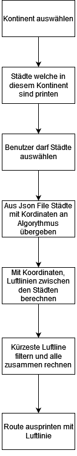

# Traveling Salesman

## Algorithmus

Zuerst werden alle mögliche Kombinationen der eingegebenen Städte generiert. Danach iteriert man mit einem For-Loop
durch alle Kombinationen.
"distance" wird auf 0 gesetzt und "combination" wird mit der Start-Stadt ergänzt.
Mit einem verschachtelten For-Loop wird auf "distance", die Fluglinie von zwei Städten,
addiert. Wenn der innere For-Loop durch ist, dann wird geschaut, ob "distance" kleiner ist als "min_distance", wenn das
der Fall ist, dann wird die jetzige distance min_distance und der min_path wird mit der jetzigen combination gesetzt.
Hiermit wird die Kombination mit den kleinsten Distanzen berechnet.



## Methoden

### calc_flight_line(x1, y1, x2, y2)

Diese Methode verlangt 4 Parameter **(x1,y1,x2,y2)**. Damit wird die Distanz zwischen zwei Städte berechnet. X und y
referenzieren auf die X- und Y-Koordinaten einer Stadt. Für die Berechnung wird eine einfache quadratische Gleichung
verwendet.

### traveling_salesman()

Diese Methode ist das Herzstück des Scripts. Hier wird mithilfe des Algorithmus (im Kapitel Algorithmus beschrieben),
die kürzeste Route zwischen den eingegebenen Städte berechnet.

## Daten

Die Daten sind in einem strukturierten JSON gespeichert. Das JSON-File "**cities.json**" beinhaltet ein "**continent**"
Objekt,
welches ein "**North America**" und "**Europe**" Attribut besitzt. Diese zwei Attribute sind jeweils Listen mit 25
verschiedenen
Städte, welche im Kontinent liegen.

```
{
  "continents": {
    "Europe": [
      {
        "id": 26,
        "name": "London",
        "x": 51.509865,
        "y": -0.118092
      }
}
```

Dies hier ist ein Beispiel wie es im JSON aussieht. Wie schon beschrieben gibt es Kontinente mit einer Liste von Städte.

## Libraries

Um die Kombinationen zu generieren, verwenden wir **permutations von itertools**.
<br>
Für die Berechnung der Distanz zwischen zwei Städte wird **math** verwendet.
Da es eine JSON-Datei ist, kann man diese sehr einfach in Python lesen. Hierfür verwenden wir "**json.load()**".

## User Infos


